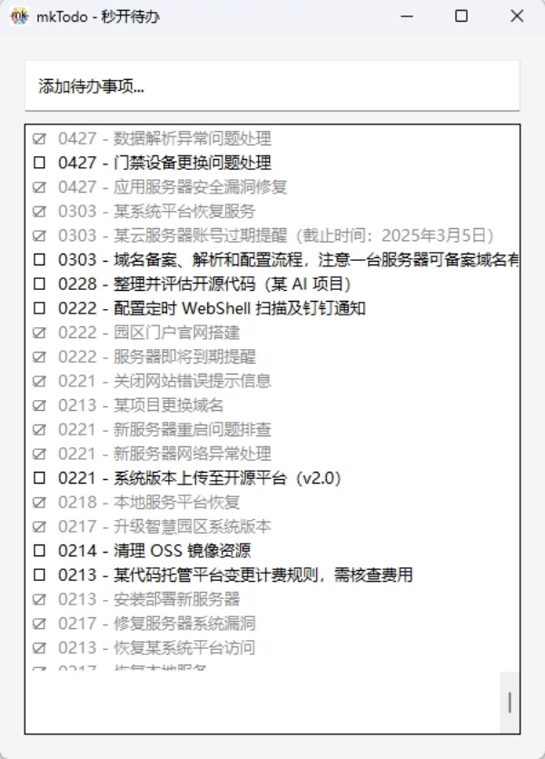

# mkTodo 秒开待办

秒开待办 – 顾名思义，一款可以“秒开”的待办事项

市面很多待办工具启动慢，功能繁杂，强制登录，登录后常驻内存，拖慢系统，而大部分情况下， 我只是简单记录下防止忘记。

与其相比，“秒开待办”启动为几十毫秒左右，用时秒开，用完即关，无任何负担，强烈建议您固定任务栏（作者一直常驻任务栏，有什么任务点开便可记录）

使用 Python/Tkinter 开发，极简设计，无冗余功能。


## 功能特性

- ✨ 极简的界面设计，无多余元素
- 📝 极简的功能添加、展示、编辑、删除待办事项，无冗余功能，无账户无广告
- 🎨 双击完成、右键删除，无其他的快捷键
- ✅ 标记完成/未完成状态
- 🔄 鼠标左键拖拽排序
- 💾 自动保存数据
  
  

## 应用截图



## 技术栈

- Python 3.10+
- Tkinter GUI框架
- JSON 数据存储
  
  

## 使用说明

1. 添加 - 在输入框中输入内容，按回车或点击添加按钮

2. 右键编辑 - 右键编辑已添加内容

  3.双击完成 - 双击项目切换完成/未完成状态

4. 左键拖拽 - 左键按住拖拽项目可以调整顺序

5. 数据存储 - 数据自动保存在当前目录下的 `mkTodo.json` 文件中，程序启动时自动加载上次的数据

## 开发说明

1. 环境要求
   
   - Python 3.10 或更高版本
   - Tkinter (通常随Python一起安装)

2. 运行项目
   
   ```bash
   git clone https://github.com/xfee/mkTodo.git
   cd mkTodo
   python mkTodo.py
   ```

3. 打包项目
   
   ```bash
   # 方式一：使用 spec 文件（推荐）
   pyinstaller mkTodo.spec
   
   # 方式二：文件夹模式【推荐】。文件夹模式启动时无需解压exe，具有更快的启动速度
   pyinstaller --windowed --name=mkTodo --clean --icon=images/favicon.ico mkTodo.py
   
   # 方式三：单文件模式。由于单文件模式启动时需要解压exe，启动比文件夹更慢一些
   pyinstaller --windowed --name=mkTodo --clean  --onefile mkTodo.py
   
   # 方式四： 使用nuitka(推荐，打包慢，但打包出的文件更小，启动速度更快)
   nuitka --standalone --windows-disable-console --output-dir=out --windows-icon-from-ico=images/favicon.ico mkTodo.py

   ```

   > 注：项目中的 `mkTodo.spec` 文件是 PyInstaller 的配置文件，包含了应用的打包设置（如图标、名称等）。有了这个文件，只需使用 `pyinstaller mkTodo.spec` 命令即可重新构建应用，无需每次都指定所有参数。
   > 注2： 如果打包不生效，可删除mkTodo.spec 后重新打包。
   > Nuitka 是一个 Python → C/C++ 编译器，比 pyinstaller 更底层，会把 Python 代码编译成真正的机器代码，生成性能更好、更难反编译的可执行程序,但打包速度非常慢。尤其首次需要下载编译器。

## 注意事项

- 确保运行目录有写入权限（用于保存 mkTodo.json）
- 【推荐】文件夹模式启动更快，建议优先使用此模式
- 单文件模式启动较慢，但便于分发

## 下载可执行文件

如您对源码和打包等无兴趣，可直接从[Releases](https://github.com/xfee/mkTodo/releases)页面下载作者已打包好的最新版本直接使用。

## 未来计划

- [ ] 添加任务分类功能

- [ ] 数据导入导出

- [ ] 主题切换

- [ ] 快捷键支持

## 贡献

欢迎提交问题和功能请求。如果您想贡献代码，请先开issue讨论您想要更改的内容。

## 许可证

本项目采用 MIT 许可证 - 详见 [LICENSE](LICENSE) 文件

## 联系方式

如有问题，请通过 [GitHub Issues](https://github.com/xfee/mkTodo/issues) 联系我
